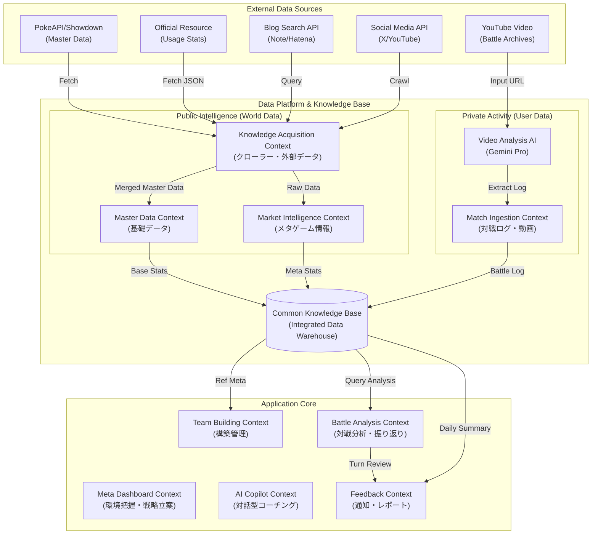

# ドメインモデル設計書

## コンテキストマップ

## ドメインモデル詳細

### 1. Data Platform & Knowledge Base (統合データ基盤)
すべてのデータが集約されるシステムの中核。

#### Unified Knowledge Base (共通ナレッジベース)
BigQuery等のDWH上に構築される、統合されたデータの貯蔵庫。
Public Data（世界の情報）と Private Data（個人の活動）がここで結合され、横断的な分析を可能にする。

#### Public Intelligence (World Data)
ユーザーの行動とは無関係に存在する、客観的な事実や外部のトレンド。

- **Knowledge Acquisition Context**: 複数のソースからデータを収集・統合し、高い網羅性を担保する。
  - **PokeAPI / Showdown**: （Master Data用）
  - **Meta Stats Sources**:
    - **Official Resource (resource.pokemon-home.com)**: 公式サーバーの公開エンドポイント（`https://resource.pokemon-home.com/battledata/t_rankmatch.html` 等）から、正確なランクマ統計データのJSONを取得・解析する。
    - **Pikalytics**: 補完的な統計データソース。
  - **Article/Social Sources**:
    - **Primary Blog Sources (Google Custom Search API)**: 
        - **Note (`site:note.com`)**: ポケモン対戦コミュニティで最も活発なプラットフォーム。
        - **Hatena Blog (`site:hatenablog.com`)**: 伝統的に構築記事が多く投稿されるプラットフォーム。
        - クエリ例: `"構築記事" AND "レギュレーションG" site:note.com OR site:hatenablog.com`
    - **X (Twitter) API**: 特定のハッシュタグ (#ポケモンSV, #ダブルバトル) や有力プレイヤーのアカウントからトレンド情報を収集。
    - **YouTube Data API**: "Regulation G VGC" 等の動画タイトル・概要欄からメタ情報を抽出。

- **Master Data Context**:
  PokeAPIとShowdownのデータを統合(Merge)して生成される。
  不変に近いポケモンの事実データだが、**ゲームタイトルやレギュレーション（世代・パッチ）による変動**を厳密に管理する。
  - **GameTitle**: 「ポケモンSV」「ポケモンレジェンズZA」などのゲームタイトル。
  - **Regulation**: 「レギュレーションG」などのルールセット。有効期間と使用可能ポケモン定義を持つ。
  - **PokemonSpecies & Snapshot**:
    - **基本**: ID, 名前, フォルム(Region/Form), タイプ1/2, 特性(通常1/2/夢)。
    - **Battle Stats**: 種族値(H-A-B-C-D-S), **重さ(Weight)**(草結び等), 性別比, **進化可否**(輝石判定)。
    - **Learnset (習得技)**: そのバージョン/レギュレーションで習得可能な技IDのリスト（レベル技、わざマシン、タマゴ技）。
  - **Move (技情報)**:
    - **基本**: ID, 分類(物理/特殊/変化), 威力, 命中, PP。
    - **Competitive Logic**: **優先度(Priority)**, **対象範囲(Target Scope)**(単体/全体/敵全体/味方/自分 - ダブルバトルで必須), 急所ランク, 連続攻撃数。
    - **Effect Flags**: 接触(Contact), 音(Sound), パンチ, 切断, 弾, 粉, 守る貫通(Feint)などの対戦ロジック用フラグ。
    - **Secondary Effect**: 追加効果の種類と確率(%)。
  - **Item (持ち物)**:
    - **Category**: きのみ, 強化アイテム, こだわり系, チョッキ(技制限)などの効果分類。
    - **Battle Param**: 投げつける威力, 消費フラグ。
  - **Nature (性格)**: 補正箇所(±10%), 木の実の好み。

- **Market Intelligence Context**:
  流動的なメタゲーム情報を管理し、「今何が強いか」を定義する。
  - **UsageSnapshot (使用率統計)**:
    - **Season/Period**: 集計期間（シーズンX, または直近7日間など）。
    - **Rankings**: 使用率順位リスト。
    - **PokemonMeta**: その期間の特定ポケモンの詳細データ（採用技シェア%, 持ち物シェア%, テラスタイプ%, **一緒に入っているポケモン(Teammates)**）。
  - **MetaArchetype (環境定義)**:
    - システムまたは管理者が定義する「環境に存在する主要な並び」。
    - 例: "Big 6", "Rain(雨パ)", "TrickRoom(トリル)", "Dondozo-Tatsugiri(寿司)".
    - **Signature**: そのアーキタイプを判別するための構成要素（必須ポケモン、必須技）。
  - **Article (構築記事/情報)**:
    - **Source**: 記事のURL, タイトル, 著者, 公開日。
    - **Content**: 本文テキスト（検索・要約用）。
    - **ExtractedTeam**: 
      - **RawData**: レンタルパ画像やPOテキスト。
      - **AdjustmentKnowHow**: **「誰をターゲットにした調整か（Adjustment Intent）」**の記述（例: "H252 B4 = ガブリアスの地震確定耐え"）。自然言語処理で抽出する。
      - **Archetype**: 自動判定されたアーキタイプ分類。
    - **Tags**: 自動/手動付与されるタグ（"最終3桁", "初心者向け", "検証記事"）。

#### Private Activity (User Data)
ユーザー自身の対戦や行動によって生成される固有データ。

- **Match Ingestion Context**:
  対戦データを収集・正規化し、「分析可能な状態」にする領域。
  - **MatchRecord (対戦記録)**:
    - **Metadata**: 日時, ゲームソフト(SV), レギュレーション, 動画URL(YouTube timestamp).
    - **Result**: 勝敗, 試合時間, 切断有無.
    - **Tags**: ユーザーが付与する「反省タグ」（プレミ, 運負け, 選出ミス etc）.
  
  - **Participant (対戦参加者)**:
    - **MySide**: 使用構築ID, 選出4体, テラスタイプ使用有無.
    - **OpponentSide**: 相手構築（見せ合い6体）, 選出4体, トレーナー名, ランク順位.
    - **OpponentArchetype**: Market Intelligenceの定義に基づき、相手構築を自動/手動で分類したアーキタイプ（例: "Calyrex-Ice TrickRoom"）.

  - **BattleLog (対戦詳細ログ)**:
    - Showdown互換形式（またはそれに準ずるJSON）での保持を目指す。
    - **Turn**: ターン番号.
    - **Action**: 技使用(Move), 交代(Switch), 特殊システム使用(Terastal/MegaEvolution/Dynamax).
    - **Event**: ダメージ(HP変動), 状態異常, 瀕死(Faint).
  - **VideoProcessor (動画・AI解析)**:
    - **Core Engine**: **Gemini Pro (Multimodal AI)** を活用。
    - **Workflow**:
      1. YouTubeの配信終了後、アーカイブURLをGeminiに渡す。
      2. プロンプトにより「対戦開始・終了タイムスタンプ」「勝敗」「お互いの選出（Showdown形式テキスト）」を抽出させる。
      3. 可能であればターンごとのログ解析も試行する。
  
  - **IngestionLevel**:
    - **Level 2 (Baseline)**: 【必須】日時, ゲーム, レギュレーション, 動画URL, 勝敗, 自分の構築(6匹+選出順), 相手の構築(6匹). Geminiにより自動化可能。
    - **Level 3 (Advanced)**: ターンごとの行動、ダメージ量、急所などの詳細ログ。Geminiの精度次第で段階的に導入。

### 2. Application Core (アプリケーションコア)
データ基盤上のデータを活用し、ユーザー価値を提供する領域。

#### Meta Dashboard Context (環境分析・戦略立案)
対戦前に「現在のメタゲーム」を俯瞰し、戦略を練るためのコックピット。
- **MetaLandscape (メタ概況)**:
  - **TierList**: UsageSnapshotを元に、自動または手動でTier（S, A, B...）を定義・可視化する。
  - **ArchetypeTrends**: 流行している構築タイプ（雨、トリル、寿司など）の増減トレンド。
  
- **IdeaBoard (アイデアボード)**:
  - **Clip**: Market Intelligenceから収集した記事や、Xのポスト、動画URLを「参考資料」としてボードに貼り付ける。
  - **Memo**: クリックした情報に対する個人のメモ。「この調整は面白い」「この並びが流行りそう」など。

- **Hypothesis (仮説形成)**:
  - **Logic**: "If [Condition: ガチグマが増えている] Then [Action: ボディプレス持ちアーマーガアが刺さる]" のような形式で、メタに対する仮説を定義する。
  - **Status**: 仮説の状態管理（Draft -> Ready for Test -> Proven -> Rejected）。
  - ※このHypothesisは、後のTeam Building（構築）の根拠としてリンクされる。

- **TrendAlert**: 急上昇しているポケモンや構築をハイライトする。

#### Team Building Context (構築管理)
自分のパーティを管理し、その「設計意図」を言語化して保存する領域。
- **Team (パーティ)**:
  - **Concept**: 構築のコンセプト（例: "追い風スタン", "トリルスイッチ"）。
  - **Version**: 調整を行うたびにバージョンを管理（v1.0 -> v1.1）。
  - **LinkedHypothesis**: Meta Dashboardで定義した「仮説」との紐付け（この構築は何の仮説に基づいているか）。

- **Slot (スロット)**: 1〜6匹目の枠。
  - **CustomPokemon**:
      - **BaseSpec**: 
        - **Basic**: 特性(Ability), 性格(Nature), 実数値 (EVs/IVs/Level).
        - **QuantitativeMetrics**:
          - **PowerIndex (火力指数)**: 各技の威力 × 攻撃実数値 × 補正。
          - **DurabilityIndex (耐久指数)**: 
            - **Physical (物理)**: HP実数値 × 防御実数値 / 0.411.
            - **Special (特殊)**: HP実数値 × 特防実数値 / 0.411.
            - **Overall (総合)**: 物理と特殊のバランスを考慮した独自指標。
        - **Moves/Item**: 技構成, 持ち物.
    - **BattleMechanicsConfig**:
      - **TeraType**: (Optional) レギュレーションで許可されている場合のみ設定可能。
      - **TransformationMode**: メガシンカ/ダイマックス/テラスタル(ステラ)などの形態変化フラグ。
        - これを有効化（Check ON）すると、**対応するフォルムの種族値や特性（例: メガガルーラ, テラパゴス・ステラ）** に動的に切り替わり、実数値計算に反映されるドメインロジックを持つ。

    - **AdjustmentIntent (調整意図)**:
      - **DamageCalc**: 「C187ハバタクカミのムーンフォース確定耐え」などの具体的なダメージ計算ライン。
      - **SpeedLine**: 「最速135族抜き」などの素早さ調整意図。
      - ※過去の記事や自分の履歴から「よくある調整」をリコメンド可能にする。

- **MatchupStrategy (選出・立ち回り想定)**:
  - MetaDashboardの「主要アーキタイプ」に対して、この構築でどう戦うかを定義する。
    - **TargetArchetype**: (例: vs 雨パ)
    - **Selection**: 基本選出（先発: A, B / 後発: C, D）。
    - **GamePlan**: 「初手はこれで荒らして、最後はDで詰める」といったテキストメモ。
  - これを事前に定義しておくことで、対戦時の迷いを減らし、対戦後の振り返り（想定通りだったか？）の質を高める。

#### Battle Analysis Context (対戦分析・振り返り)
対戦ログと結果を元に、「なぜ勝った/負けたか」を構造的に分析する領域。
- **b (振り返り)**:
  - **TurnReview**: ターンごとの行動評価（Good/Bad/Miss）。
    - ログに対して「ここはAではなくBを選択すべきだった」というメモを残す。 AIが確率計算の観点から指摘することもある。
  - **KeyTurn**: 勝敗を分けた決定的なターン（Turning Point）を特定・タグ付けする。
  
- **GapAnalysis (敗因分析)**:
  - 負けた原因（Gap）を3つの層に分類して記録する。
    1. **Knowledge Gap (知識不足)**: 「相手のSラインを知らなかった」「技の仕様を勘違いしていた」。 -> Unified KBへのリンクやドキュメント参照を促す。
    2. **Design Gap (構築の欠陥)**: 「そもそもこの構築では相手の並び（Calyrex-Ice + TR）に対抗できない」。 -> Team Buildingへのフィードバック（Matchup Strategyの修正）。
    3. **Play Gap (プレイングミス)**: 「知識も構築もあったが、選択を間違えた」「確率の低い択を通してしまった」。 -> Simulation機能での反復練習へ。

- **MVP**: その試合で最も活躍した/活躍できなかったポケモンを投票。Team Buildingの選出率/勝率データに反映される。

- **TeamPerformance (定量的チーム分析)**:
  - 特定のチーム(Version)における統計データを集計し、ダッシュボード化する。
  - **Overall**: 総合勝率, 対戦数, 先攻/後攻別勝率。
  - **SlotAnalysis**: 各ポケモンの詳細スタッツ。
    - **SelectionRate**: 選出率 (先発% / 後発% / 選出されなかった%).
    - **WinRate**: 選出時の勝率。
    - **KillLog**: 「どの技で誰を倒したか」ランキング（例: ハバタクカミのムーンフォース -> ウーラオス 15回）。
    - **DeathLog**: 「誰のどの技で倒されたか」ランキング（例: ゴリランダーのグラススライダーで瀕死 -> 8回）。
  - これにより、「選出率は高いが勝率が低い（＝足手まとい）」や「特定の技でカモにされている」傾向を可視化する。

#### AI Copilot Context (対話型コーチング)
Common Knowledge Base を頭脳に持ち、全てのコンテキストでユーザーを支援する相棒。
- **Interface**:
  - **ChatBot**: 独立したチャット画面。「今のメタで強い構築は？」「昨日の試合の反省点は？」などの自由な質問に対応。
  - **InlineSupport**: 各画面（Team Building, Battle Analysis）に常駐し、コンテキストに沿った助言を能動的に行う（例: 構築画面で「この並びだと重いポケモンがいます」と警告）。

- **KnowledgeSource (RAG)**:
  - 以下のデータを横断的に検索(Retrieve)して回答を生成(Generate)する。
    1. **Public Data**: 種族値、技データ、メタ使用率（Market Intelligence）。
    2. **Private Data**: ユーザーの構築(Team)、対戦ログ(Match)、過去の反省(Gap)。
    3. **Domain Knowledge**: ドキュメント化された対戦理論（タイプ相性、S操作の重要性など）。

- **Features**:
  - **Advisor**: 戦略相談。
  - **Analyst**: ログ解析・指摘。
  - **Simulation (模擬戦・検証)**:
    - **QuizMode**: ユーザーの過去のミス局面を再現し、「どう動くべきか？」を問う教育モード。
    - **DamageSimulator**: 
      - 天候(Weather)、フィールド(Terrain)、持ち物(Item)、特性(Ability)、壁(Screens)などの**盤面補正を全て加味した精密な計算エンジン**。
      - 「雨下のハチマキ水流連打で倒せるか？」といった質問に対し、乱数確率（%）と共に回答する。
  - **Continuous Learning**: ユーザーとの対話履歴を記憶し、「このユーザーはS操作を軽視しがち」といった癖を学習してアドバイスをパーソナライズする。

#### Feedback Context (通知・レポート)
システムからの能動的な働きかけにより、ユーザーの継続的な改善サイクルを回す領域。
- **DailyReport (日次レポート)**:
  - その日の対戦結果サマリ（5勝3敗 +25LPなど）。
  - **Today's Insight**: 「今日は対雨パの勝率が悪かったです(20%)」「新しく採用したゴリランダーの選出率が高かったです」といった自動生成コメント。
  - **NewArticles**: 新着の構築記事があれば、そのタイトル・URL・**要約（3行程度）**を掲載する。
  
- **WeeklyTrends (週次トレンド)**:
  - 1週間のメタゲーム変動（流行ったポケモン）と、自分の適応度を振り返るレポート。

- **DiscordNotifier**:
  - **Realtime**: （オプション）対戦終了直後の簡易Result通知。
  - **Digest**: 毎朝決まった時間にDailyReportをDiscordに送信する。
  - **Alert**: TrendAlert（急上昇構築）を即座に通知する。

### 3. Infrastructure Considerations
(詳細は `system_architecture.md` 参照)
- **Data Lake (GCS)**: Raw JSON/HTMLを保存。
- **Data Warehouse (BigQuery)**: 分析用に構造化されたデータを保持。
