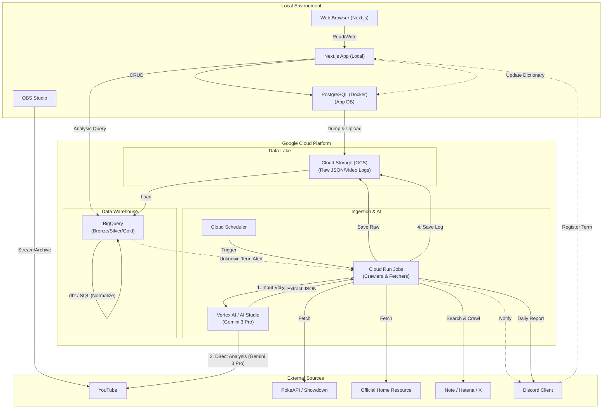

# システムアーキテクチャ設計書

## アーキテクチャ概要

ユーザー（個人開発者）にとっての運用コストの低さと、データ分析基盤としての拡張性を両立するため、Google Cloud (GCS + BigQuery) を中心としたサーバーレス構成を採用する。
特筆すべき点として、**Gemini Pro (Multimodal AI)** を対戦動画解析のコアエンジンとして採用し、従来困難だった非構造化データ（動画）の取り込みを自動化する。

## コンポーネント詳細

### 1. データパイプライン & AI解析
- **Crawlers / Fetchers (Cloud Run Jobs)**:
  - **Master Data**: PokeAPI + Showdown GitHubからデータを取得・統合。
  - **Meta Stats**: `resource.pokemon-home.com` からJSONを取得。
  - **Articles**: 
    - Google Custom Search API (Note, Hatena).
    - **Global Sources**: Victory Road, Smogon Forums, Showdown Usage Stats.
- **Video Analysis (Google AI Studio API)**:
  - **Model**: **Gemini 3 Pro** (User Specified). 
    - Google AI Proライセンスを使用し、長時間の動画コンテキストも高速に処理する。
  - **Flow**:
    1. **Input**: Cloud Run Jobsから対象のYouTube動画URLをAPIに直接渡す（**Direct URL Analysis**）。
    2. **Process**: Gemini 3 ProがYouTube上の動画に直接アクセスし、プロンプトに基づいて解析を実行する（ダウンロード/アップロード不要）。
    3. **Output**: 解析結果のJSONを受け取り、GCSへ保存する。

- **Orchestration & Frequency**:
  Cloud Scheduler -> Cloud Run Jobs の構成を基本とし、BigQuery内での変形のみ dbt を用いる。

| Data Source | Frequency | Trigger |
| :--- | :--- | :--- |
| **Master Data** | Ad-hoc | **Manual** (ソフト更新/DLC発売時) |
| **Meta Stats** | Daily | Scheduled (**10:00 JST** - 切替後) |
| **Articles** | Daily | Scheduled (**07:00 JST** - 朝の収集) |
| **Video Archives** | **Every 6 Hours** | **Polling** (6時間毎に新着動画をチェックし、未解析のアーカイブがあれば順次実行) |

### 2. データレイク (GCS) 構成
BigQueryからのロード効率とコスト最適化のため、Hiveパーティショニング形式を採用し、適切なライフサイクルポリシーを設定する。
保存フォーマットは、BigQueryがネイティブ対応している **JSONL (NewSD JSON)** を基本とする。

| Folder (Prefix) | Partition Key | File Format | Lifecycle | Description |
| :--- | :--- | :--- | :--- | :--- |
| `raw/master_pokeapi/species/` | `snapshot_date=YYYY-MM-DD` | JSON | Keep Last 3 Versions | 全量。ポケモン種族データ。 |
| `raw/master_pokeapi/moves/` | `snapshot_date=YYYY-MM-DD` | JSON | Keep Last 3 Versions | 全量。技データ。 |
| `raw/master_pokeapi/abilities/` | `snapshot_date=YYYY-MM-DD` | JSON | Keep Last 3 Versions | 全量。特性データ。 |
| `raw/master_pokeapi/items/` | `snapshot_date=YYYY-MM-DD` | JSON | Keep Last 3 Versions | 全量。持ち物データ。 |
| `raw/master_pokeapi/natures/` | `snapshot_date=YYYY-MM-DD` | JSON | Keep Last 3 Versions | 全量。性格補正データ。 |
| `raw/master_pokeapi/types/` | `snapshot_date=YYYY-MM-DD` | JSON | Keep Last 3 Versions | 全量。タイプ相性表。 |
| `raw/meta_home/ranking/` | `dt=YYYY-MM-DD` | JSONL | Coldline after 90 days | 日次。Pokemon HOME使用率。 |
| `raw/articles/note/` | `dt=YYYY-MM-DD` | JSONL | Coldline after 180 days | Note検索結果。 |
| `raw/articles/hatena/` | `dt=YYYY-MM-DD` | JSONL | Coldline after 180 days | はてなブログ検索結果。 |
| `raw/articles/global/` | `dt=YYYY-MM-DD` | JSONL | Coldline after 180 days | 海外サイト(VictoryRoad, Smogon)の収集データ。 |
| `raw/video_logs/gemini_output/` | `video_id=X/dt=YYYY-MM-DD` | JSON | Archive (No Delete) | Geminiの解析結果JSON。 |

**Bucket Strategy**:
- `gs://{project-id}-datalake` (Single Bucket)
- フォルダ階層でデータソースを管理し、権限管理やライフサイクル設定をシンプルに保つ。

### 3. アプリケーションデータベース (Local PostgreSQL)
- **Role**: ローカル開発環境(Docker)で動作する **System of Record (SoR)**。
- コスト削減のためCloud SQLは使用せず、まずはローカルで完結させる。
- **Sync to BigQuery**: `pg_dump` 等でJSON/CSV出力し、GCSへアップロードすることでデータ統合を行う。

### 4. データウェアハウス (BigQuery) スキーマ設計
ELTパターンを採用し、3層構造（Bronze/Silver/Gold）で管理する。
特に **「表記揺れの吸収（名寄せ）」** をSilver層の最重要責務とし、人間による補完ループ（Human-in-the-Loop）を組み込む。

#### Layer 1: Bronze (Raw Data)
GCS上のJSONを外部テーブル(External Table)として参照する層。
- `bronze.ext_pokeapi_species`
- `bronze.ext_home_rankings`
- `bronze.ext_battle_logs_gemini`: Geminiが解析した生の非構造化JSON（表記揺れを含む）。
- `bronze.ext_blog_articles`: スクレイピングしたブログ記事のRawテキスト。
- **`bronze.ext_user_db_dump`**: Local PostgreSQLから同期されたユーザーデータ。

#### Layer 2: Silver (Warehouse / Normalized)
Bronzeデータをクレンジング・正規化し、マスターデータと紐付けた状態。
**名寄せプロセス**: `dim_term_dictionary` を参照し、表記揺れを正規IDに変換する。
- **Master Data**:
  - `dim_pokemon`: 基本種族値(BaseStats)。
  - `dim_moves`, `dim_item`, `dim_nature`, `dim_ability`, `dim_types`.
  - **`dim_pokemon_learnset`**: ポケモンごとの習得技リスト。
  - **`dim_type_chart`**: タイプ相性マトリクス。
  - `dim_term_dictionary`: **名寄せ辞書**。
- **User Context (From Local DB)**:
  - `dim_my_team`: 構築のバージョン管理。
  - `dim_my_team_slot`: 各スロットの詳細。**PowerIndex, DurabilityIndex** などの定量指標も保持。
  - `dim_adjustment_intent`: 調整意図のテキスト。
- **Transaction**:
  - `fct_match_record`: 対戦結果、自パーティID、相手パーティと紐付け。
  - `fct_battle_log_detail`: ターンごとの詳細ログ（Kill/Death情報を含む）。
  - `err_unknown_terms`: **名寄せ失敗テーブル**。辞書にない単語が出現した場合ここに記録される。

#### Layer 3: Gold (Mart / Application)
アプリや分析ダッシュボードから直接参照する集計済みデータ。
- `mart_dashboard_tierlist`: 最新Tier表。
- `mart_team_performance`: 構築ごとの勝率、選出率（先発/後発）、**Kill/Deathランキング**。
- `mart_daily_report_insight`: 日次レポート用サマリ。
- `mart_simulation_quiz`: プレイングミス(Gap)から生成されたクイズデータ。

### 5. アプリケーション & 通知フロー (可視化・還流)

#### Application (可視化・管理)
- **Platform**: **Local Docker (Next.js 16)**. Cloud Runへのデプロイは将来的なオプションとする。
- **Framework**: **Next.js App Router**.
  - **Server Actions**: Local DB (PostgreSQL) へのセキュアなアクセス。
  - **Vercel AI SDK**: AI Copilot (ChatBot) の実装に利用。Google AI Studio API (Gemini 3 Pro) とストリーミング通信を行う。

#### Notification (還流・ガバナンス)
- **Discord Integration**:
  - Webhook URLを環境変数で管理し、以下のイベントを通知する。
    1. **Data Governance (Human-in-the-Loop)**:
       - **Event**: dbt等で `unknown_term` (辞書未登録単語) を検知。
       - **Action**: "未知の単語: 'ハバカミ' を検出しました。登録してください [Link]" と通知。
    2. **Daily Report**:
       - **Event**: 毎朝 07:00 JST (記事収集後) or 10:00 JST (Home更新後)。
       - **Action**: 前日の戦績サマリ、新着記事要約、環境トレンドのハイライトを送信。
    3. **Trend Alert**:
       - **Event**: 特定のポケモン/構築の使用率が急上昇(例: +10% Day-over-Day)した場合。
       - **Action**: "Trend Alert: カイリューの採用率が急増中!" と即時に通知。
